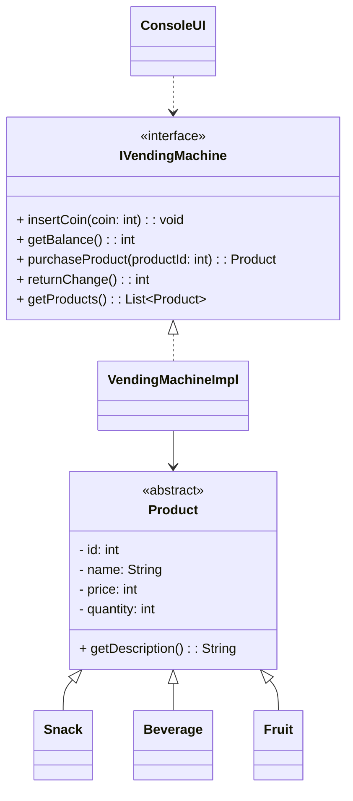

# Vending Machine — OOP Workshop Project

A fully object-oriented vending machine application built in Java.  
Designed according to UML specifications and implemented using:

- Inheritance
- Polymorphism
- Abstraction
- Encapsulation
- Interface-driven design
- JUnit testing
- Console-based UI

---

## 🎯 Features

### ✔ Product Management
The vending machine supports multiple product types:

- Snacks
- Beverages
- Fruits

Each product inherits from an abstract `Product` class and provides its own description.

### ✔ Payment System
- Accepts only valid coins: **1, 2, 5, 10, 20, 50**
- Invalid coins are rejected
- Balance is tracked internally

### ✔ Purchasing Logic
A purchase succeeds only if:

1. The product exists
2. The product is in stock
3. The balance is sufficient

After purchase:
- Stock decreases
- Balance is reduced by product price

### ✔ Change Handling
Users can return all remaining balance at any time.

### ✔ Console UI
A simple text-based menu allows users to:
- View products
- Insert coins
- Purchase items
- Return change

---

## 🧪 JUnit Tests

The project includes tests for:

- Valid/invalid coin insertion
- Successful purchase
- Insufficient balance
- Out-of-stock behavior
- Returning change
- Product list retrieval

These tests ensure the vending machine logic behaves correctly.

---

## 📦 Project Structure

